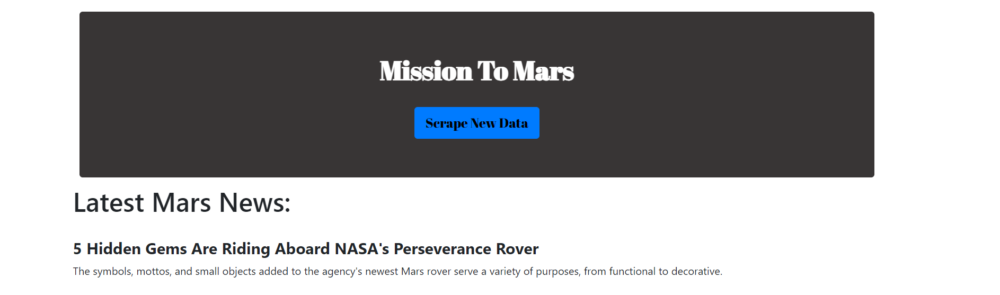
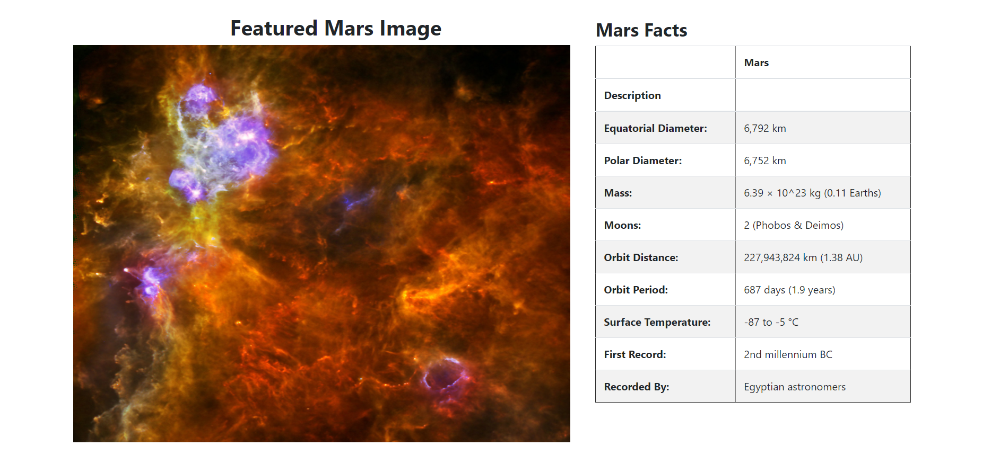
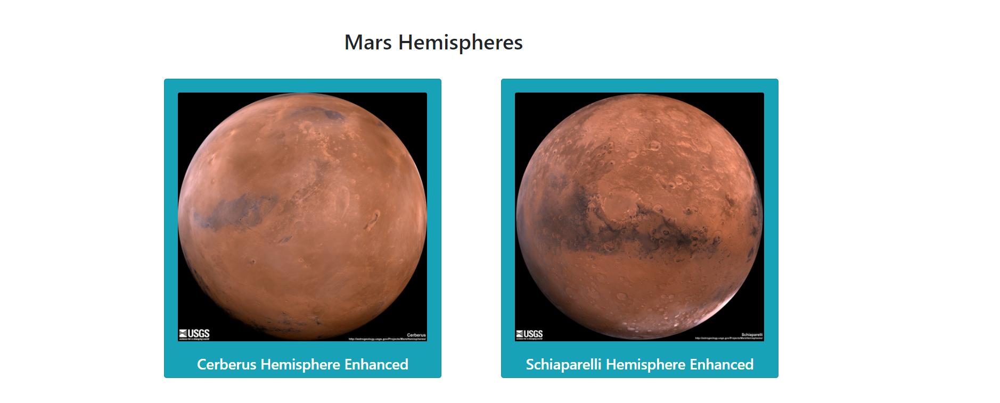
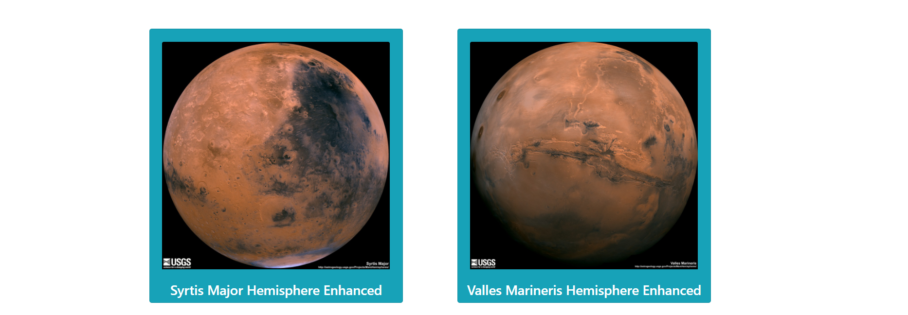

# [Mission to Mars Project Page](https://github.com/fereshtehaghaei/WebScrapingChallenge) 

Building a web application that scrapes various websites for data related to the Mission to Mars and displays the information in a single HTML page. 

### Step 1 - Scraping

#### NASA Mars News

* Scraped the NASA Mars News Site and collected the latest News Title and Paragraph Text

#### JPL Mars Space Images - Featured Image

* Used Splinter to navigate the site and find the image URL for the current Featured Mars Image and assigned the URL string to a variable called `featured_image_url`
* Made sure to find the image URL to the full size `.jpg` image
* Made sure to save a complete URL string for this image

#### Mars Facts

* Visited the Mars Facts webpage and used Pandas to scrape the table containing facts about the planet including Diameter, Mass, etc.
* Used Pandas to convert the data to a HTML table string

#### Mars Hemispheres

* Visited the USGS Astrogeology site to obtain high resolution images for each of Mar's hemispheres
* Saved both the image URL string for the full resolution hemisphere image, and the Hemisphere title containing the hemisphere name. 
    * Used a Python dictionary to store the data using the keys `img_url` and `title`
* Append the dictionary with the image URL string and the hemisphere title to a list
    * This list will contain one dictionary for each hemisphere

### Step 2 - MongoDB and Flask Application

* Used MongoDB with Flask templating to create a new HTML page that displays all of the information that was scraped from the URLs above
* Converted Jupyter Notebook into a Python Script called `scrape_mars.py` with a function called `scrape` that will execute all of the scraping code from above and return one Python Dictionary containing all of the scraped data
* Created a route called `/scrape` that will import the `scrape_mars.py` script and call the `scrape` function
    * Stored the return value in Mongo as a Python Dictionary
* Created a root route `/` that will query the Mongo database and pass the Mars Data into an HTML template to display the data
* Created a template HTML file called `index.html` that will take the Mars Data Dictionary and display all of the data in the appropriate HTML elements

- - -

### Copyright

Fereshteh Aghaei © 2021. All Rights Reserved.